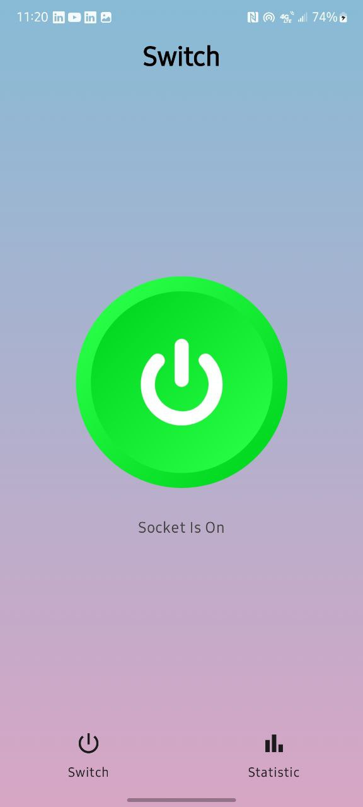
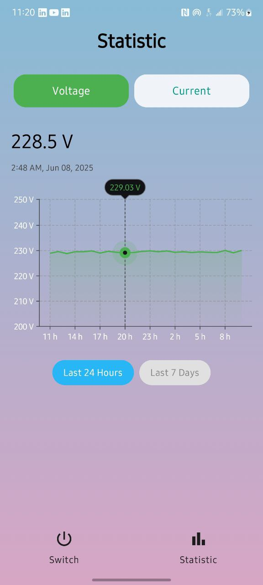

# 📱 Smart Socket App

Інтелектуальний мобільний застосунок для дистанційного керування розумною розеткою з можливістю перегляду статистики енергоспоживання та вимірювання електропараметрів в реальному часі.

---

## 🚀 Основні можливості

- 🔌 **Керування розеткою:** Увімкнення / вимкнення реле живлення.
- 📈 **Графіки напруги та струму:** 
  - Статистика за останні 24 години та 7 днів.
  - Перемикання між графіками напруги та струму.
- 📊 **Live-дані:** Миттєве відображення останніх вимірювань.
- 🌙 **Сучасний UI:** Побудований на Jetpack Compose + Material3.
- 🌐 **Підключення до API:** Взаємодія з бекендом через Ktor.

---

## 🧠 Технології

| Категорія         | Технології |
|-------------------|------------|
| Мова              | Kotlin     |
| Архітектура       | MVVM + Koin |
| UI                | Jetpack Compose, Material3 |
| Мережа            | Ktor client |
| Серіалізація      | Kotlinx Serialization |
| Статистика        | Vico Charts |
| DI                | Koin       |

---

## 📦 Структура проєкту

<details>
  <summary>Натисни, щоб розгорнути</summary>

```
ai.learning.smartsocketapp
├── MainActivity.kt
├── SocketApp.kt
├── core/
│   ├── di/
│   ├── model/
│   ├── navigation/
│   ├── network/
│   ├── ui/common/bottom_bar/
├── feature/
│   ├── home/
│   ├── statistic/
```

</details>

---

## 🗺 Екрани

- **HomeScreen** – кнопка перемикання реле та статус.
- **StatisticScreen** – графіки струму та напруги з фільтрами.

---

## 🌐 API

```
Base URL: https://smart-socket-app-dcedd173cf01.herokuapp.com/api/

GET    /latest              -> Отримати останні показники
GET    /relay               -> Отримати стан реле
POST   /relay?state=true    -> Змінити стан реле
GET    /statistics/24h      -> Статистика за добу
GET    /statistics/7d       -> Статистика за тиждень
```

---

## ▶️ Як запустити

1. **Клонуй проєкт:**
   ```bash
   git clone https://github.com/your-user/smart-socket-app.git
   ```

2. **Відкрий у Android Studio.**

3. **Перевір налаштування SDK (minSdk = 26, targetSdk = 34).**

4. **Запусти застосунок на емуляторі чи реальному пристрої.**

---

## ✅ Вимоги

- Android Studio Giraffe або новіша
- Android SDK 34
- Kotlin 1.9+
- Gradle 8+

---

## 📸 Скріншоти

### 🏠 Головний екран


### 📊 Статистика



---

## 👤 Автор

**Володимир Василишин**  
📧 volodymyr.vasylyshyn05@gmail.com
